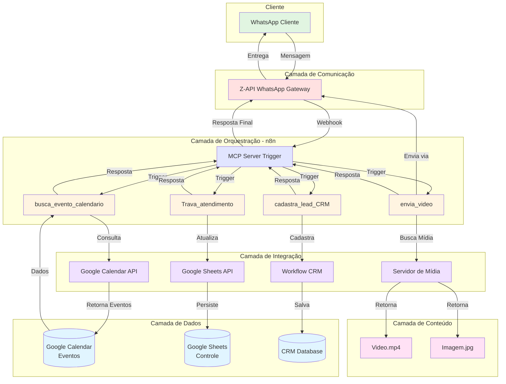
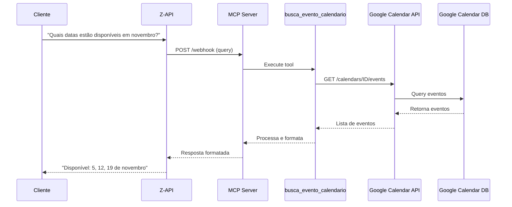
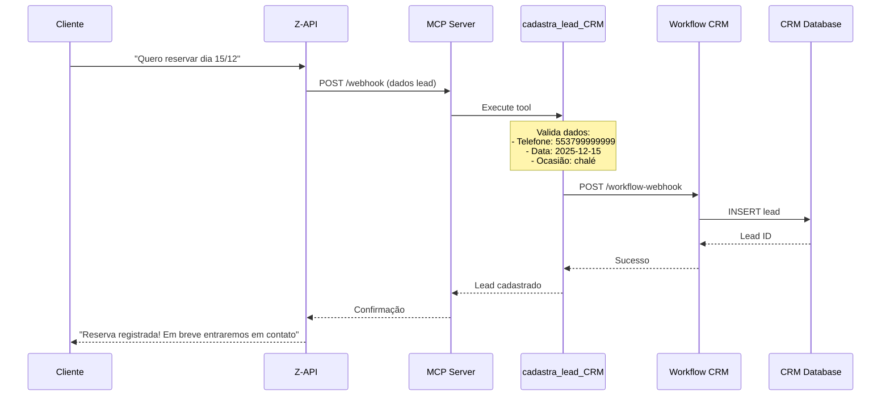
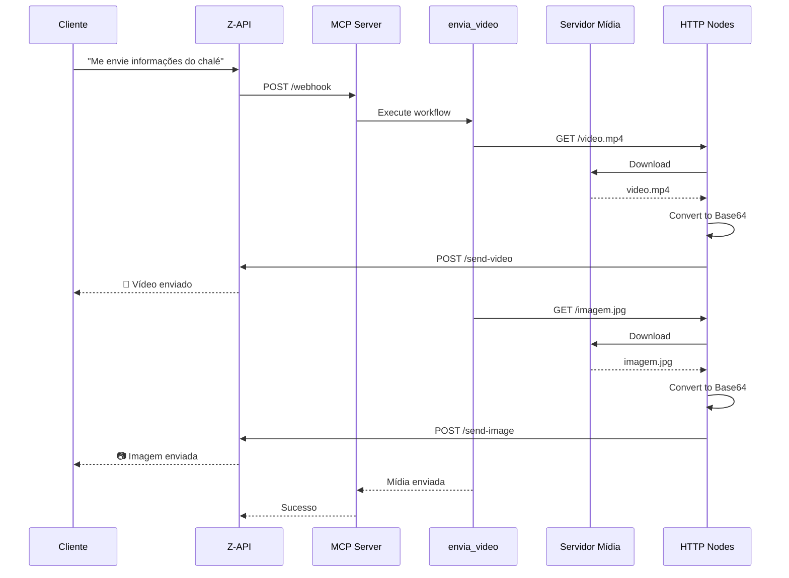
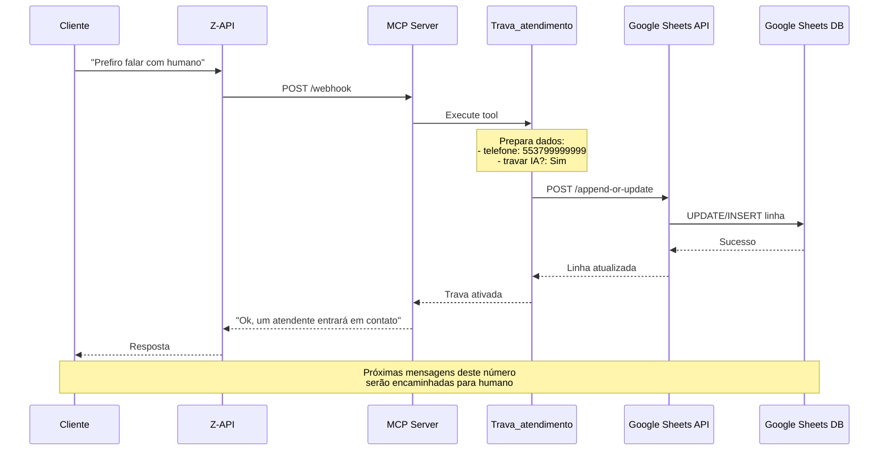

# 🏗️ Arquitetura do Sistema

## Visão Geral

O sistema Dalvonete IA Agent é uma solução de atendimento automatizado que integra múltiplos serviços para gerenciar reservas e leads de forma eficiente.

## Diagrama de Arquitetura



## Fluxo de Dados Detalhado

### 1. Fluxo de Consulta de Eventos



### 2. Fluxo de Cadastro de Lead



### 3. Fluxo de Envio de Vídeo



### 4. Fluxo de Trava de Atendimento



## Componentes do Sistema

### 1. MCP Server (Model Context Protocol)

**Localização:** n8n - Workflow "MCP DALVONETE"

**Responsabilidades:**
- Receber requisições via webhook
- Gerenciar contexto da conversa
- Orquestrar chamadas às tools
- Formatar respostas

**Configuração:**
```yaml
Path: mcpdalvnotes
Webhook ID: 843562d8-1843-4ca2-84ce-0ffeec19cf18
Type: @n8n/n8n-nodes-langchain.mcpTrigger
```

### 2. Tools (Ferramentas)

#### busca_evento_calendario

**Tipo:** Google Calendar Tool  
**Função:** Buscar disponibilidade de datas

**Parâmetros de entrada:**
- `timeMin`: ISO 8601 datetime
- `timeMax`: ISO 8601 datetime

**Saída:**
```json
[
  {
    "id": "event_id",
    "summary": "Reserva Cliente X",
    "start": {
      "dateTime": "2025-11-05T14:00:00Z"
    },
    "end": {
      "dateTime": "2025-11-07T12:00:00Z"
    }
  }
]
```

#### cadastra_lead_CRM

**Tipo:** Workflow Tool  
**Função:** Cadastrar novos leads

**Parâmetros de entrada:**
```json
{
  "nome": "string",
  "telefone": "string (13 dígitos)",
  "ocasiao": "chalé|evento",
  "data_do_evento": "YYYY-MM-DD",
  "cidade": "string"
}
```

**Validações:**
- Telefone: deve ter 13 dígitos (DDI + DDD + número)
- Data: formato ISO (YYYY-MM-DD)
- Ocasião: exatamente "chalé" ou "evento"

#### envia_video

**Tipo:** Workflow Tool  
**Função:** Enviar vídeo e imagem promocional

**Parâmetros de entrada:**
```json
{
  "telefone": "string (13 dígitos)"
}
```

**Processo interno:**
1. HTTP Request → Download video.mp4
2. Extract from File → Convert to Base64
3. HTTP Request → Send via Z-API
4. HTTP Request → Download imagem.jpg
5. Extract from File → Convert to Base64
6. HTTP Request → Send via Z-API

#### Trava_atendimento

**Tipo:** Google Sheets Tool  
**Função:** Marcar número para atendimento humano

**Parâmetros de entrada:**
```json
{
  "telefone": "string (13 dígitos)"
}
```

**Ação:**
- Busca telefone na planilha
- Se existe: atualiza "travar IA?" para "Sim"
- Se não existe: cria nova linha

### 3. Integrações Externas

#### Z-API (WhatsApp Business API)

**Endpoints utilizados:**
```
POST /instances/{instance}/token/{token}/send-video
POST /instances/{instance}/token/{token}/send-image
POST /instances/{instance}/token/{token}/send-text
```

**Autenticação:**
- Header: `Client-Token: F6ebb1eaa3864462d97a9207743613045S`
- Instance: `3E5F68ACE46F30605A0B2E6C7627E5AC`
- Token: `9F8363362C4A59C1CC7D5326`

**Limites:**
- Vídeo: máx 16MB
- Imagem: máx 5MB
- Rate limit: 100 mensagens/minuto

#### Google Calendar API

**API Version:** v3  
**Scope:** `https://www.googleapis.com/auth/calendar`

**Métodos utilizados:**
```
GET /calendars/{calendarId}/events
- Parâmetros: timeMin, timeMax, maxResults
- Retorna: lista de eventos
```

#### Google Sheets API

**API Version:** v4  
**Scope:** `https://www.googleapis.com/auth/spreadsheets`

**Métodos utilizados:**
```
POST /spreadsheets/{spreadsheetId}/values:append
- Adiciona novas linhas
- Parâmetros: range, values

PUT /spreadsheets/{spreadsheetId}/values/{range}
- Atualiza linhas existentes
- Parâmetros: values
```

### 4. Servidor de Mídia

**Status Atual:**
```
URL Base: https://jaguarpro.com.br/dalvonete/
Arquivos:
- video.mp4 (vídeo promocional)
- imagem (foto do chalé)
```

**Migração Planejada:**
```
URL Base: https://DOMINIO-DALVONETE.com.br/dalvonete/
Arquivos:
- video.mp4
- imagem.jpg
```

**Requisitos:**
- Acesso público (sem autenticação)
- HTTPS obrigatório
- CORS configurado para aceitar requests do n8n
- Cache configurado para otimizar downloads

## Infraestrutura

### Easypanel

**URL:** hjmnzb.easypanel.host

**Serviços:**
- n8n (orquestração)
- [Futuro] Servidor de mídia

**Recursos:**
- CPU: [Configurar conforme necessidade]
- RAM: Mínimo 2GB recomendado para n8n
- Storage: [Configurar conforme necessidade]

### n8n

**URL:** https://n8n-n8n-start.degwfm.easypanel.host

**Versão:** [Verificar versão instalada]

**Configurações importantes:**
```env
WEBHOOK_URL=https://n8n-n8n-start.degwfm.easypanel.host
N8N_PROTOCOL=https
N8N_HOST=n8n-n8n-start.degwfm.easypanel.host
```

## Segurança

### Autenticação e Autorização

1. **n8n:**
   - Login com email/senha
   - Sem autenticação de dois fatores (considerar ativar)

2. **Google APIs:**
   - OAuth 2.0
   - Tokens de acesso refreshable
   - Scopes limitados ao necessário

3. **Z-API:**
   - Token de instância
   - Client-Token nos headers
   - Sem IP whitelist (considerar adicionar)

### Dados Sensíveis

**Credenciais armazenadas no n8n:**
- Credenciais Google (OAuth2)
- Tokens Z-API
- Webhook URLs

**⚠️ Importante:**
- Nunca commite workflows com credenciais
- Use variables/secrets do n8n
- Rotacione tokens periodicamente

### Comunicação

**Todos os endpoints devem usar HTTPS:**
- ✅ n8n: HTTPS
- ✅ Z-API: HTTPS
- ✅ Google APIs: HTTPS
- ⚠️ Servidor de mídia: Confirmar HTTPS após migração

## Monitoramento

### Métricas Importantes

1. **Taxa de sucesso dos workflows:**
   - Meta: >95% de execuções bem-sucedidas

2. **Tempo de resposta:**
   - Busca de eventos: <2s
   - Cadastro de lead: <3s
   - Envio de vídeo: <10s

3. **Taxa de erro:**
   - Meta: <5% de erros

### Logs

**Localização:** n8n → Executions

**Níveis de log:**
- Error: Falhas críticas
- Warning: Problemas não-críticos
- Info: Execuções normais
- Debug: Informações detalhadas

### Alertas

**Configurar notificações para:**
- Falha em workflow crítico
- Taxa de erro acima de 10%
- Credencial expirando em 7 dias
- Espaço em disco <20%

## Escalabilidade

### Limites Atuais

1. **n8n:**
   - Execuções simultâneas: ~10 (default)
   - Pode ser aumentado nas configurações

2. **Z-API:**
   - 100 mensagens/minuto
   - Upgrade disponível se necessário

3. **Google APIs:**
   - Calendar: 1M requests/dia (gratuito)
   - Sheets: 100 requests/100s/user

### Planos de Crescimento

**Fase 1 (Atual):**
- Atendimento de 1-10 leads/dia
- 1 instância n8n
- Servidor de mídia básico

**Fase 2 (Futuro):**
- Atendimento de 50+ leads/dia
- n8n com mais workers
- CDN para mídia
- Múltiplas instâncias Z-API

**Fase 3 (Escala):**
- Atendimento de 500+ leads/dia
- Cluster n8n
- Sistema de cache distribuído
- Auto-scaling

## Backup e Recuperação

### Estratégia de Backup

1. **Workflows n8n:**
   - Export manual mensal
   - Versionamento no Git
   - Armazenar em local seguro

2. **Google Sheets:**
   - Backup automático do Google
   - Export manual semanal (.xlsx)

3. **Google Calendar:**
   - Backup automático do Google
   - Export manual mensal (.ics)

### Plano de Recuperação

**RTO (Recovery Time Objective):** 4 horas  
**RPO (Recovery Point Objective):** 24 horas

**Passos de recuperação:**
1. Restaurar serviços (n8n, Easypanel)
2. Importar workflows do backup
3. Reconfigurar credenciais
4. Testar cada workflow
5. Ativar sistema

## Manutenção

### Tarefas Regulares

**Diária:**
- [ ] Verificar logs de erro
- [ ] Monitorar taxa de sucesso

**Semanal:**
- [ ] Revisar execuções com warning
- [ ] Verificar uso de recursos (CPU/RAM)

**Mensal:**
- [ ] Backup de workflows
- [ ] Atualizar n8n se disponível
- [ ] Revisar e rotacionar senhas

**Trimestral:**
- [ ] Audit de segurança
- [ ] Revisar e otimizar workflows
- [ ] Atualizar documentação

---

**Última atualização:** Outubro 2025
