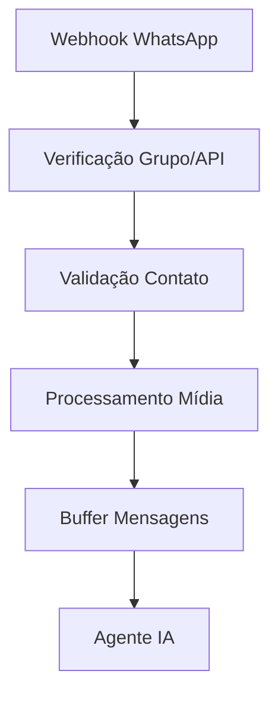

# AI SDR Dalvonete 🤖💬

Um agente de vendas (SDR) inteligente automatizado para WhatsApp que utiliza IA para qualificar leads, agendar reuniões e gerenciar o funil de vendas para o "Espaço do Lago" - um local para eventos e hospedagem.

## 🚀 Funcionalidades

### Processamento Inteligente de Mensagens
- **Texto**: Processamento direto de mensagens de texto
- **Áudio**: Transcrição automática usando OpenAI Whisper
- **Imagens**: Análise e extração de texto usando Google Vision API
- **Documentos**: Processamento de PDFs com OCR e análise inteligente

### Agente de Vendas IA
- **Qualificação Automática**: Identifica interesse em chalé vs espaço para eventos
- **Verificação de Disponibilidade**: Integração com Google Calendar
- **Cadastro Automático**: Registra leads no CRM automaticamente
- **Memória Conversacional**: Mantém contexto usando PostgreSQL

### Integrações
- 🎯 **CRM**: Cadastro automático de leads e deals
- 📅 **Google Calendar**: Verificação de disponibilidade
- 📊 **Google Sheets**: Controle de atendimento e travamento de IA
- 💬 **WhatsApp**: Comunicação via Z-API
- 🧠 **OpenAI**: GPT-4 para conversas e análise
- 📱 **MCP Server**: Ferramentas personalizadas

## 📁 Estrutura do Projeto

```
ai-sdr-dalvonete/
├── workflows/
│   ├── main-sdr-workflow.json
│   ├── crm-registration.json
│   ├── video-sender.json
│   └── mcp-dalvonete.json
├── docs/
│   ├── SETUP.md
│   ├── WORKFLOWS.md
│   └── API.md
├── config/
│   ├── environment.example.env
│   └── credentials.example.json
├── scripts/
│   ├── backup-workflows.sh
│   └── restore-workflows.sh
├── assets/
│   └── architecture-diagram.png
├── README.md
├── LICENSE
└── CHANGELOG.md
```

## 🛠️ Configuração e Instalação

### Pré-requisitos

- [n8n](https://n8n.io/) versão 1.0+
- PostgreSQL 13+
- Redis 6+
- Node.js 18+

### APIs Necessárias

1. **OpenAI API** - Para processamento de IA
2. **Google Cloud Vision API** - Para análise de imagens
3. **Google Calendar API** - Para verificação de disponibilidade
4. **Google Sheets API** - Para controle de dados
5. **Z-API** - Para WhatsApp Business
6. **CRM API** (Bubble.io) - Para cadastro de leads

### Instalação

1. **Clone o repositório**
```bash
git clone https://github.com/seu-usuario/ai-sdr-dalvonete.git
cd ai-sdr-dalvonete
```

2. **Configure as variáveis de ambiente**
```bash
cp config/environment.example.env .env
# Edite o arquivo .env com suas credenciais
```

3. **Configure o PostgreSQL**
```sql
CREATE DATABASE dalvonete_ai;
CREATE TABLE dalvonete_chat (
    id SERIAL PRIMARY KEY,
    session_id VARCHAR(255),
    message_type VARCHAR(50),
    content TEXT,
    created_at TIMESTAMP DEFAULT CURRENT_TIMESTAMP
);
```

4. **Configure o Redis**
```bash
redis-server
```

5. **Importe os workflows no n8n**
```bash
# Use a interface do n8n ou:
./scripts/restore-workflows.sh
```

## 🔧 Configuração Detalhada

### Variáveis de Ambiente

```env
# OpenAI
OPENAI_API_KEY=sk-...

# Google APIs
GOOGLE_VISION_API_KEY=AIzaSy...
GOOGLE_CALENDAR_CREDENTIALS={"type": "service_account"...}
GOOGLE_SHEETS_CREDENTIALS={"type": "service_account"...}

# Z-API WhatsApp
ZAPI_INSTANCE_ID=3E5F68ACE46F30605A0B2E6C7627E5AC
ZAPI_TOKEN=9F8363362C4A59C1CC7D5326
ZAPI_CLIENT_TOKEN=F6ebb1eaa3864462d97a9207743613045S

# CRM
CRM_API_URL=https://dalvonete.jaguarpartnes.com.br/api/1.1
CRM_TOKEN=Bearer 45bad1dc1e69478a687386a98e591708

# Banco de Dados
POSTGRES_HOST=localhost
POSTGRES_DB=dalvonete_ai
POSTGRES_USER=n8n
POSTGRES_PASSWORD=senha_segura

# Redis
REDIS_HOST=localhost
REDIS_PORT=6379
```

### Credenciais n8n

Configure as seguintes credenciais no n8n:

1. **OpenAI API** (`openAiApi`)
2. **Google Calendar OAuth2** (`googleCalendarOAuth2Api`)
3. **Google Sheets OAuth2** (`googleSheetsOAuth2Api`)
4. **PostgreSQL** (`postgres`)
5. **Redis** (`redis`)

## 📊 Fluxo de Trabalho

### 1. Recepção de Mensagem


### 2. Processamento IA
- **Análise de Intent**: Identifica se é chalé ou evento
- **Coleta de Dados**: Nome, data, cidade, telefone
- **Verificação Disponibilidade**: Consulta Google Calendar
- **Cadastro CRM**: Registra lead automaticamente

### 3. Scripts de Atendimento

#### Para Chalé:
1. Boas-vindas + identificação
2. Envio de vídeo promocional
3. Coleta de data desejada
4. Verificação disponibilidade
5. Cadastro e finalização

#### Para Eventos:
1. Boas-vindas + identificação
2. Coleta de data e cidade
3. Cadastro direto no CRM
4. Encaminhamento para humano

## 🔧 Manutenção

### Backup dos Workflows
```bash
./scripts/backup-workflows.sh
```

### Monitoramento
- Logs do n8n em `/home/n8n/.n8n/logs/`
- Métricas Redis via `redis-cli info`
- Status PostgreSQL via `pg_stat_activity`

### Troubleshooting

**Problema**: Mensagens não processadas
- Verificar webhook ativo
- Validar credenciais Z-API
- Checar logs n8n

**Problema**: IA não responde
- Verificar saldo OpenAI
- Validar conexão PostgreSQL
- Checar configuração MCP

## 📈 Métricas e Analytics

### KPIs Importantes
- Taxa de conversão de leads
- Tempo médio de resposta
- Volume de mensagens processadas
- Eficácia por tipo de mídia

### Dados Coletados
- Histórico conversacional (PostgreSQL)
- Leads cadastrados (CRM)
- Disponibilidade consultada (Google Calendar)
- Status atendimento (Google Sheets)

## 🛡️ Segurança

### Boas Práticas
- Tokens em variáveis de ambiente
- Validação de entrada de dados
- Rate limiting implementado
- Logs sem dados sensíveis

### Compliance
- LGPD: Dados coletados com consentimento
- WhatsApp Business Policy: Mensagens dentro das regras
- Retenção de dados: 90 dias por padrão

## 🚀 Deploy

### Produção
1. Configure servidor Ubuntu 20.04+
2. Instale Docker e Docker Compose
3. Use o arquivo `docker-compose.yml` incluído
4. Configure proxy reverso (Nginx)
5. Ative SSL (Let's Encrypt)

### Ambiente de Desenvolvimento
```bash
docker-compose -f docker-compose.dev.yml up
```

## 🤝 Contribuição

1. Fork o projeto
2. Crie uma branch feature (`git checkout -b feature/nova-funcionalidade`)
3. Commit suas mudanças (`git commit -am 'Adiciona nova funcionalidade'`)
4. Push para a branch (`git push origin feature/nova-funcionalidade`)
5. Abra um Pull Request

## 📝 Changelog

### v1.0.0 (2025-01-15)
- ✨ Agente IA inicial com processamento multimídia
- 🔗 Integração completa CRM e Google Workspace
- 💬 Scripts de atendimento para chalé e eventos
- 🧠 Sistema de memória conversacional
- 📊 Dashboard de métricas básicas

## 📄 Licença

Este projeto está licenciado sob a Licença MIT - veja o arquivo [LICENSE](LICENSE) para detalhes.

## 📞 Suporte

- **Email**: suporte@espacodolago.com.br
- **WhatsApp**: +55 37 99999-9999
- **GitHub Issues**: Para bugs e feature requests

## 🏗️ Arquitetura Técnica

```
┌─────────────────┐    ┌─────────────────┐    ┌─────────────────┐
│   WhatsApp      │───▶│     n8n         │───▶│   OpenAI GPT    │
│   (Z-API)       │    │   Workflows     │    │     API         │
└─────────────────┘    └─────────────────┘    └─────────────────┘
                                │
                       ┌─────────────────┐
                       │   PostgreSQL    │
                       │   (Memória)     │
                       └─────────────────┘
                                │
┌─────────────────┐    ┌─────────────────┐    ┌─────────────────┐
│  Google APIs    │───▶│     Redis       │───▶│   CRM Bubble    │
│ (Cal/Sheets)    │    │   (Buffer)      │    │     API         │
└─────────────────┘    └─────────────────┘    └─────────────────┘
```

---

**Desenvolvido com ❤️ para automatizar e humanizar o atendimento digital do Espaço do Lago**